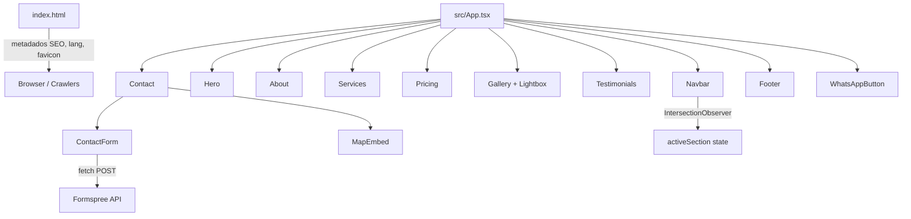
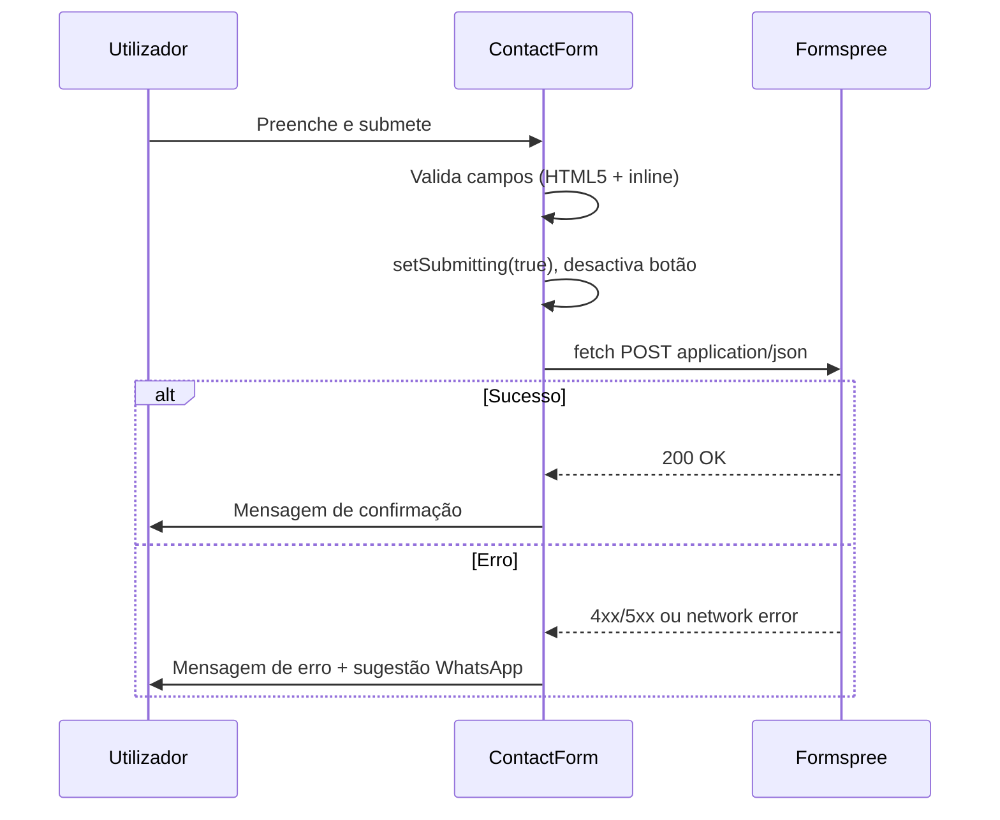

# Documento de Design Técnico — Website Improvements

## Visão Geral

Este documento descreve a arquitectura técnica e as decisões de implementação para as melhorias do site **Fashion Mito**. O site é uma Single Page Application (SPA) construída em React 19, TypeScript, Tailwind CSS v4 e Framer Motion (`motion/react`), servida via Vite.

As melhorias abrangem nove áreas: SEO/metadados HTML, performance de imagens, navbar com secção activa, galeria com lightbox, formulário de contacto funcional via Formspree, mapa OpenStreetMap, secção de preços, conteúdo em português correcto e acessibilidade.

Todas as alterações são feitas nos ficheiros existentes (`index.html`, `src/App.tsx`, `src/index.css`) sem introduzir dependências externas adicionais além das já presentes.

---

## Arquitectura

O site mantém a arquitectura SPA de ficheiro único. Não existe routing — a navegação é feita por scroll com âncoras (`#section-id`). Cada requisito é implementado como uma modificação cirúrgica ao componente ou ficheiro relevante.



### Fluxo de dados do formulário



---

## Componentes e Interfaces

### 1. `index.html` — SEO e Metadados

Ficheiro estático modificado directamente. Não é um componente React.

**Alterações:**
- `<html lang="pt">`
- `<title>` correcto
- `<meta name="description">` (150–160 chars)
- Open Graph: `og:title`, `og:description`, `og:type`, `og:url`, `og:image`
- Twitter Card: `twitter:card`, `twitter:title`, `twitter:description`
- `<meta name="robots" content="index, follow">`
- `<link rel="canonical">`
- `<link rel="icon">`
- Geolocalização: `geo.region`, `geo.placename`, `geo.position`

### 2. `Navbar` — Indicador de Secção Activa

```typescript
// Estado interno
const [activeSection, setActiveSection] = useState<string>('home');

// IntersectionObserver observa todas as secções com id
// threshold: 0.4 — secção activa quando 40% visível
// Ao clicar num link, actualiza activeSection imediatamente
```

**Interface do link activo:**
```typescript
interface NavLink {
  name: string;
  href: string;       // ex: '#home'
  sectionId: string;  // ex: 'home'
}
```

Estilo activo: `text-gold border-b border-gold` (cor dourada + sublinhado).  
`aria-current="page"` aplicado ao link activo.

### 3. `Gallery` + `Lightbox` — Galeria Expandida

```typescript
interface GalleryImage {
  src: string;
  alt: string;        // descrição acessível
  caption: string;    // legenda visível (tipo de peça + material)
  span: string;       // classes Tailwind para grid span
}

interface LightboxState {
  isOpen: boolean;
  currentIndex: number;
}
```

**Comportamento:**
- 8+ imagens em grid assimétrico (`grid-cols-2 md:grid-cols-4`, `auto-rows`)
- Clique numa imagem → abre `Lightbox` com `currentIndex`
- Teclas `ArrowLeft`/`ArrowRight` → navegação; `Escape` → fechar
- Clique no overlay fora da imagem → fechar
- Botões prev/next visíveis no lightbox
- `useEffect` com `addEventListener('keydown', ...)` limpo no cleanup

### 4. `ContactForm` — Formulário Funcional via Formspree

```typescript
interface FormData {
  name: string;
  email: string;
  phone: string;       // opcional
  service: string;     // select: Fatos Sob Medida | Ajustes | Uniformes | Vestuário Tradicional
  message: string;
}

type FormStatus = 'idle' | 'submitting' | 'success' | 'error';
```

**Integração Formspree:**
```typescript
// Sem pacote extra — fetch nativo
const res = await fetch('https://formspree.io/f/{FORM_ID}', {
  method: 'POST',
  headers: { 'Content-Type': 'application/json', 'Accept': 'application/json' },
  body: JSON.stringify(formData),
});
```

Validação inline: campo obrigatório vazio → mensagem de erro junto ao campo (`<p role="alert">`).

### 5. `MapEmbed` — OpenStreetMap via iframe

```typescript
// Sem API key — iframe público do OpenStreetMap
const OSM_URL =
  'https://www.openstreetmap.org/export/embed.html' +
  '?bbox=32.5600,−25.9800,32.6000,−25.9400' +
  '&layer=mapnik' +
  '&marker=−25.9653,32.5732';
```

Altura mínima 256px, largura 100%. Link "Abrir no Google Maps" em nova aba.

### 6. `Pricing` — Secção de Preços Indicativos

```typescript
interface PricingPlan {
  name: string;        // ex: 'Essencial'
  price: string;       // ex: 'A partir de 3.500 MT'
  features: string[];
  highlighted: boolean; // plano em destaque (Premium)
}
```

Posicionada entre `<Services />` e `<Gallery />` no JSX do `App`.  
Hover com `whileHover={{ scale: 1.03 }}` via Framer Motion.  
Botão CTA → `scrollIntoView` para `#contact`.

### 7. Imagens — Performance

| Imagem | `loading` | `decoding` | `width`/`height` |
|---|---|---|---|
| Hero (fundo) | `eager` | `sync` | 2000 / 1333 |
| About | `lazy` | `async` | 1000 / 1333 |
| Serviços (4x) | `lazy` | `async` | 800 / 533 |
| Galeria (8x) | `lazy` | `async` | 600 / 400 |

Parâmetro `&w=` nos URLs Unsplash ajustado ao tamanho de exibição real.

### 8. Conteúdo e Acessibilidade

- Horário: `"Seg - Sáb: 08:00 - 18:00"` em todas as ocorrências
- Secção Sobre: referência explícita a Maputo, Moçambique
- Links sociais: URLs reais das páginas Fashion Mito
- WhatsApp: `?text=Olá%2C%20gostaria%20de%20saber%20mais%20sobre%20os%20vossos%20serviços`
- `alt` descritivo em todas as imagens
- `aria-label` em botões sem texto visível suficiente
- `aria-current="page"` no link activo do Navbar
- Ordem de foco Tab segue ordem visual (sem `tabindex` positivo)

---

## Modelos de Dados

### Estado da Aplicação (React state)

```typescript
// Navbar
activeSection: string                  // id da secção activa, ex: 'home'

// Gallery
lightbox: { isOpen: boolean; currentIndex: number }

// ContactForm
formData: FormData                     // campos do formulário
formStatus: 'idle' | 'submitting' | 'success' | 'error'
fieldErrors: Partial<Record<keyof FormData, string>>  // erros inline

// Pricing (sem estado — estático)
```

### Estrutura de dados estáticos

```typescript
// Galeria — 8 imagens
const galleryImages: GalleryImage[] = [
  { src: '...', alt: 'Fato bespoke em lã italiana', caption: 'Fato Bespoke — Lã Italiana', span: 'col-span-2 row-span-2' },
  { src: '...', alt: 'Ajuste de vestido de gala', caption: 'Ajuste de Gala — Seda', span: 'col-span-1' },
  // ... 6 mais
];

// Preços — 3 planos
const pricingPlans: PricingPlan[] = [
  { name: 'Essencial', price: 'A partir de 3.500 MT', features: [...], highlighted: false },
  { name: 'Premium',   price: 'A partir de 7.000 MT', features: [...], highlighted: true  },
  { name: 'Bespoke',   price: 'Sob Consulta',         features: [...], highlighted: false },
];
```

---

## Correctness Properties

*Uma propriedade é uma característica ou comportamento que deve ser verdadeiro em todas as execuções válidas do sistema — essencialmente, uma afirmação formal sobre o que o sistema deve fazer. As propriedades servem de ponte entre especificações legíveis por humanos e garantias de correcção verificáveis por máquina.*

### Propriedade 1: Comprimento da meta description

*Para qualquer* valor atribuído ao atributo `content` da `<meta name="description">`, o número de caracteres deve estar entre 150 e 160 (inclusive).

**Valida: Requisito 1.3**

---

### Propriedade 2: Atributos de performance em imagens não-hero

*Para qualquer* elemento `` que não seja a imagem principal da secção Hero, os atributos `loading="lazy"`, `decoding="async"`, `width` e `height` devem estar todos presentes e com valores não vazios.

**Valida: Requisitos 2.1, 2.3, 2.4**

---

### Propriedade 3: Parâmetro de largura nos URLs Unsplash

*Para qualquer* elemento `` cujo atributo `src` contenha `unsplash.com`, o URL deve incluir o parâmetro `w=` com um valor numérico positivo.

**Valida: Requisito 2.5**

---

### Propriedade 4: Invariante do link activo no Navbar

*Para qualquer* valor de `activeSection`, exactamente um link de navegação deve ter simultaneamente o estilo visual activo (classe de cor dourada) e o atributo `aria-current="page"`. Todos os outros links não devem ter nenhum destes atributos.

**Valida: Requisitos 3.2, 3.4, 9.3**

---

### Propriedade 5: Navegação circular no Lightbox

*Para qualquer* array de `n` imagens (n ≥ 2) e qualquer índice `i` válido, navegar para a próxima imagem deve resultar no índice `(i + 1) % n`, e navegar para a anterior deve resultar no índice `(i - 1 + n) % n`.

**Valida: Requisito 4.4**

---

### Propriedade 6: Legendas não vazias na Galeria

*Para qualquer* imagem no array `galleryImages`, o campo `caption` deve ser uma string não vazia e o campo `alt` deve ser uma string não vazia e descritiva (comprimento > 5 caracteres).

**Valida: Requisitos 4.6, 9.1**

---

### Propriedade 7: Estado do botão de submissão durante envio

*Para qualquer* estado do formulário em que `formStatus === 'submitting'`, o botão de submissão deve ter o atributo `disabled` igual a `true`.

**Valida: Requisito 5.6**

---

### Propriedade 8: Validação inline de campos obrigatórios

*Para qualquer* tentativa de submissão do formulário em que um ou mais campos obrigatórios (`name`, `email`, `message`, `service`) estejam vazios, o objecto `fieldErrors` deve conter uma entrada não vazia para cada campo em falta, e o envio para Formspree não deve ser iniciado.

**Valida: Requisito 5.7**

---

### Propriedade 9: Ausência de texto em inglês no horário

*Para qualquer* string de texto visível no DOM que represente horário de funcionamento, essa string não deve conter as abreviaturas inglesas `"Mon"`, `"Tue"`, `"Wed"`, `"Thu"`, `"Fri"`, `"Sat"`, `"Sun"`.

**Valida: Requisito 8.1**

---

### Propriedade 10: Alt descritivo em todas as imagens

*Para qualquer* elemento `` no DOM renderizado, o atributo `alt` deve estar presente, ser não vazio, e ter comprimento superior a 5 caracteres (excluindo strings genéricas como "image" ou "foto").

**Valida: Requisito 9.1**

---

### Propriedade 11: aria-label em elementos interactivos sem texto visível

*Para qualquer* elemento `<button>` ou `<a>` que não contenha texto visível suficiente (texto interno com menos de 3 caracteres), deve estar presente um atributo `aria-label` não vazio.

**Valida: Requisito 9.2**

---

## Tratamento de Erros

### Formulário de Contacto

| Situação | Comportamento |
|---|---|
| Campo obrigatório vazio | Mensagem inline junto ao campo; envio bloqueado |
| Erro de rede (fetch falha) | `formStatus = 'error'`; mensagem com sugestão de contacto por WhatsApp |
| Resposta Formspree 4xx/5xx | `formStatus = 'error'`; mesma mensagem de erro |
| Resposta Formspree 200 | `formStatus = 'success'`; formulário limpo; mensagem de confirmação |

### Lightbox

| Situação | Comportamento |
|---|---|
| Array de imagens vazio | Lightbox não abre (botão de clique desactivado) |
| Índice fora dos limites | Navegação circular — nunca lança erro |
| Tecla Escape com lightbox fechado | `keydown` listener ignorado (isOpen === false) |

### Mapa OpenStreetMap

| Situação | Comportamento |
|---|---|
| iframe falha a carregar | Fallback: texto "Av. 25 de Setembro, Maputo" visível; link Google Maps sempre disponível |

---

## Estratégia de Testes

### Abordagem Dual

Os testes dividem-se em dois tipos complementares:

- **Testes unitários/de exemplo**: verificam comportamentos concretos, casos de integração e condições de erro
- **Testes de propriedade (PBT)**: verificam propriedades universais sobre colecções de inputs gerados aleatoriamente

### Biblioteca de Property-Based Testing

Para TypeScript/React, usar **[fast-check](https://github.com/dubzzz/fast-check)** (sem dependências adicionais de runtime — apenas `devDependency`).

```bash
npm install --save-dev fast-check
```

Cada teste de propriedade deve correr no mínimo **100 iterações** (configuração padrão do fast-check).

### Testes Unitários / de Exemplo

Usar **Vitest** (já compatível com Vite) com **@testing-library/react**.

Exemplos de testes de exemplo a implementar:

- `index.html` tem `lang="pt"` e `<title>` correcto (Requisitos 1.1, 1.2)
- Todas as meta tags OG e Twitter estão presentes (Requisitos 1.4, 1.5)
- Imagem Hero tem `loading="eager"` (Requisito 2.2)
- Clicar numa imagem da galeria abre o lightbox com o índice correcto (Requisito 4.3)
- Premir Escape fecha o lightbox (Requisito 4.5)
- Submissão bem-sucedida mostra mensagem de confirmação (Requisito 5.2)
- Submissão falhada mostra mensagem de erro (Requisito 5.3)
- Formulário tem campo select de serviço com 4 opções (Requisito 5.4)
- iframe do mapa tem src com `openstreetmap.org` (Requisito 6.1)
- Link "Abrir no Google Maps" tem `target="_blank"` (Requisito 6.4)
- Secção de preços está posicionada entre Serviços e Galeria no DOM (Requisito 7.1)
- Array `pricingPlans` tem comprimento >= 3 (Requisito 7.2)
- Nota de rodapé de preços contém texto sobre valores indicativos (Requisito 7.4)
- Secção About contém "Maputo" e "Moçambique" (Requisito 8.3)
- Links sociais não são "#" (Requisito 8.4)
- Href do WhatsApp contém `?text=` com conteúdo em português (Requisito 8.5)

### Testes de Propriedade (fast-check)

Cada teste de propriedade referencia a propriedade do design com o formato:

```
// Feature: website-improvements, Propriedade N: <texto da propriedade>
```

| Propriedade | Teste fast-check |
|---|---|
| P1: Comprimento meta description | `fc.assert(fc.property(fc.string({minLength:150, maxLength:160}), s => s.length >= 150 && s.length <= 160))` |
| P2: Atributos de imagens não-hero | Gerar array de imagens; verificar que todas têm loading/decoding/width/height |
| P3: Parâmetro w= em URLs Unsplash | Gerar URLs Unsplash; verificar presença de `&w=\d+` |
| P4: Invariante link activo | Gerar sectionId aleatório; verificar que exactamente 1 link tem estilo activo + aria-current |
| P5: Navegação circular lightbox | `fc.assert(fc.property(fc.integer({min:2,max:20}), fc.integer({min:0}), (n, i) => nextIndex(i%n, n) === (i%n+1)%n))` |
| P6: Legendas e alt não vazios | Verificar que todo o item de galleryImages tem caption.length > 0 e alt.length > 5 |
| P7: Botão desactivado durante envio | Dado formStatus='submitting', verificar disabled=true |
| P8: Validação inline campos obrigatórios | Gerar FormData com campos vazios; verificar fieldErrors não vazio e fetch não chamado |
| P9: Ausência de inglês no horário | Gerar strings de horário; verificar ausência de Mon/Sat/etc. |
| P10: Alt descritivo em imagens | Verificar que todo o img tem alt.length > 5 |
| P11: aria-label em botões sem texto | Verificar que botões com texto curto têm aria-label |

### Configuração de Testes

```typescript
// vitest.config.ts
import { defineConfig } from 'vitest/config';
export default defineConfig({
  test: {
    environment: 'jsdom',
    globals: true,
    setupFiles: ['./src/test/setup.ts'],
  },
});
```

```typescript
// Exemplo de teste de propriedade
import * as fc from 'fast-check';
import { describe, it, expect } from 'vitest';

describe('website-improvements', () => {
  // Feature: website-improvements, Propriedade 5: Navegação circular no Lightbox
  it('P5: navegação circular no lightbox', () => {
    fc.assert(
      fc.property(
        fc.integer({ min: 2, max: 50 }),
        fc.integer({ min: 0, max: 49 }),
        (n, rawI) => {
          const i = rawI % n;
          const next = (i + 1) % n;
          const prev = (i - 1 + n) % n;
          return next >= 0 && next < n && prev >= 0 && prev < n;
        }
      ),
      { numRuns: 100 }
    );
  });
});
```
